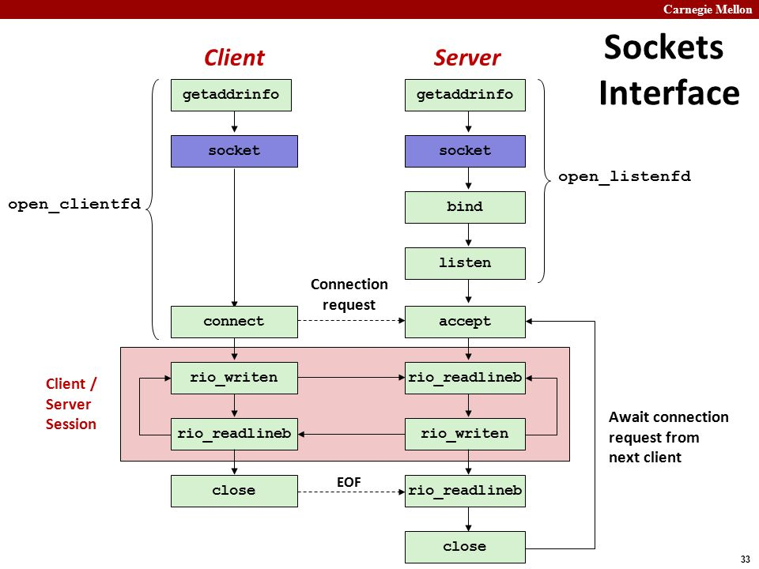

# Socket


## 通信的过程
1. Start server
 * getaddrinfo
 * socket
 * bind
 * listen
 * accept
2. Start client
 * getaddrinfo
 * socket
 * connect
3. Exchange data
 * rio_writen
 * rio_readlineb
4. Disconnect client
 * close
5. Drop client
 * rio_readlineb
 * close

## Address
For connect, bind, and accept

* Generic socket address

```c
typedef struct sockaddr SA;
struct sockaddr {
    uint16_t sa_fammily; /* protocol family */
    char     sa_data[14]; /* address data */
}
```

* Internet-specific socket address

```c
struct sockaddr_in {
    uint16_t sin_family; /* protocol family (always AF_INET) */
    uint16_t sin_port;   /* port num in network byte order(big-eddian) */
    struct in_addr sin_addr; /* IP addr in network byte order */
    unsigned char sin_zero[8]; /* pad to sizeof(struct socketaddr) */
}
```

## Interface
