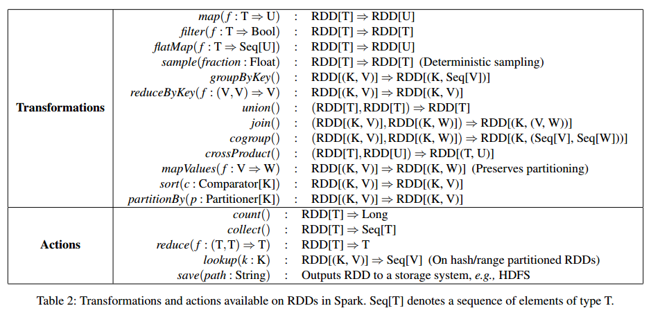

## 阅读清单

### 熟悉朴素贝叶斯、最大熵等模型在文本分类上的应用，了解优缺点

### 了解 audience selection, look alike 相关的论文

### 了解 Google, media6degree, mediagamma 等公司近年在顶级会议发表的广告投放相关的论文

### 了解 程序化交易、RTB、Ad exchange、DSP、DMP的进展与未来趋势

### 了解Spark的scala或者python开发
#### python
* https://github.com/strint/AliMusicTrendPredict

#### Scala on Spark
##### Spark
* paper [RDD: A Fault-Tolerant Abstraction for In-Memory Cluster Computing](https://people.csail.mit.edu/matei/papers/2012/nsdi_spark.pdf)

##### Scala programming on Spark
###### Spark
* MapReduce
 * 有向无环的数据流
 * 在内存中没有working set，将数据写到磁盘，然后再加载到内存
* Spark
 * 有向无环的数据流 和 有环的数据流
 * 在内存中有working set，可以方便做内存计算
 * 基于RDD，便于创建working set
 * 支持fault tolerant, locality-aware scheduling, load balancing
 * Fault-Tolerant: checkpointing the data or log the ops on data，Spark使用的是后者，记录了lineage（数据的家谱）
 * 适合数据并行、批处理模式

###### RDD
 * 弹性的分布式的数据集合
 * 一种分布式的内存抽象
 * 用于内存计算
 * 只可以批量创建，不能增量创建
 * 可读，不可修改

###### Operations
* 

### 学习李航的《统计学习方法》、PRML等机器学习相关的书
#### 李航的《统计学习方法》
#### PRML
#### 西瓜书
